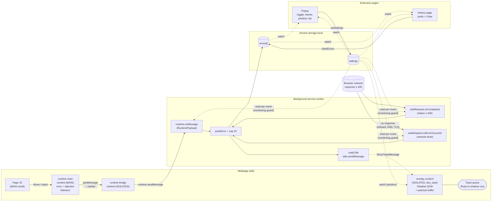

# Errly

Chrome/Firefox extension. Pass-through error logger — catches HTTP failures and JS exceptions on the current tab, surfaces them as color-coded toasts with a searchable history.

## Stack

- [WXT 0.20](https://wxt.dev) (React + TypeScript), pnpm
- Targets: Chromium MV3 + Firefox MV2 (no Safari)
- Jest + `@swc/jest` (unit), Playwright (E2E, headed + slowMo)
- No ESLint config beyond WXT default

## Commands

```
pnpm dev              # dev mode (chrome)
pnpm dev:firefox
pnpm build            # chrome production build
pnpm build:firefox
pnpm test             # jest unit
pnpm test:e2e         # build + playwright headed
pnpm compile          # tsc --noEmit
```

## Architecture



**Reading the diagram:**
- Solid arrows = direct call / network response.
- Dashed arrows = observation (storage watch) or async message delivery.
- Two capture entrypoints (`webRequest` for network, `runtime.onMessage` for runtime) converge into one `pushError`.
- Storage is the source of truth for UI; toasts are pushed directly to the tab (not derived from storage watch — see slice 5 design note).
- `Sett` (settings) gates capture in the background and parametrises rendering everywhere.

### Source layout

```
entrypoints/
  background.ts                    # webRequest.onCompleted + onErrorOccurred
                                   # + runtime.onMessage handlers,
                                   # notifyTab via tabs.sendMessage after pushError
  runtime-main.content.ts          # MAIN world: window.error + unhandledrejection
  runtime-bridge.content.ts        # ISOLATED: postMessage → runtime.sendMessage
  overlay.content/                 # ISOLATED at document_start: shadow-DOM toast queue
    index.tsx                      #   createShadowRootUi + React mount
    Toast.tsx                      #   ToastQueue component (subscribes to toast-store)
    style.css
  popup/                           # action popup
  errors/                          # /errors.html — full page.
                                   # Folder NOT named `history/` — WXT auto-maps
                                   # that to chrome_url_overrides.history.

lib/
  types.ts                         # NetworkError (statusCode 0 + errorText for net-level)
                                   # | RuntimeError discriminated union
                                   # ShowToastMessage, RuntimePayload + marker
  storage.ts                       # errors storage (get/push/clear/watch)
  cap.ts                           # pure: appendCapped (Jest-testable)
  colors.ts                        # pure: default color constants (no WXT dep)
  format.ts                        # pure: networkLabel, getRecordColor
  filter.ts                        # pure: shouldShowRecord (codeFilters) + matchesType
  search.ts                        # pure: matchesSearch (live history search)
  settings.ts                      # Settings (monitoring, theme, position,
                                   # codeFilters, codeColors)
                                   # withDefaults merge for forward-compat reads
  toast-store.ts                   # module-level pub/sub for toasts (race-proof)
  use-settings.ts                  # React: useSettings, useEffectiveTheme, ThemeApplier
  theme.css                        # shared CSS variables for light/dark via [data-theme]

tests/
  unit/                            # Jest
  e2e/
    fixture-server.mjs             # local Node http: /error /throw /reject /refused
    fixtures.ts                    # launchExtension + setMonitoring + setStorage helpers
    *.spec.ts
```

## Conventions

### Storage
- `chrome.storage.local`, separate keys for `errors` and `settings`. No bundling.
- `errors`: `ErrorRecord[]` capped at 20 via pure `appendCapped`.
- `ErrorRecord` is a discriminated union on `kind: 'network' | 'runtime'`. Common base: `id` (uuid), `timestamp`.
- `crypto.randomUUID()` for every record.

### Capture
- Filter all captures by `tabId === activeTab` via stateless `tabs.query` per event.
- Background reads `settings.monitoring` per event; default is OFF (explicit opt-in).
- `host_permissions: <all_urls>` in manifest, but UX is "current tab only".
- No dedup yet — separate slice if it becomes a real problem.
- Network failures with no response (refused/DNS/TLS) flow through `webRequest.onErrorOccurred`, not `onCompleted` — both listened, both feed the same `pushError`. `statusCode = 0` + `errorText` flags net-level.
- `net::ERR_ABORTED` is skipped: browser-cancelled requests (page navigation, AbortController) aren't errors.
- **Things still NOT captured (known gaps):** `console.error/warn` calls (only true uncaught throws/rejections are caught); requests blocked by extensions or CSP before reaching the network stack.

### Cross-context messaging
- MAIN-world content script can't use `browser.*` API — communicates with ISOLATED bridge via `window.postMessage` + magic marker (`RUNTIME_MESSAGE_MARKER`).
- Background notifies originating tab via `tabs.sendMessage(tabId, ShowToastMessage)` after `pushError`. Wrapped in try/catch — chrome:// and similar tabs have no content script.
- Content scripts needing message listeners during page load **must register `runtime.onMessage` synchronously in `main()`** before any async (shadow-root mount). Otherwise messages from page-load network fetches are lost. Buffer via module-level pub/sub (see `lib/toast-store.ts`).

### UI
- Controlled inputs that write to async storage need **optimistic local update** in `onChange` (storage.watch is too slow for Playwright's `.check()` polling).
- Theme via `data-theme` attribute on `<html>` + CSS variables in `lib/theme.css`. Both popup and history import.
- `useEffectiveTheme` resolves `'system'` via `prefers-color-scheme` matchMedia.
- Filters are **display-only**: storage holds everything captured, popup/history render via `shouldShowRecord`. Toast on-page is not filtered — toast = "this just happened" signal independent of saved-view filters.
- Group buttons (`All 4XX`/`All 5XX`) are mass-ops: `aria-pressed` when every code in the group is enabled; clicking flips all to the opposite state. No tristate.
- Settings reads merge `DEFAULT_SETTINGS` via `withDefaults` to stay forward-compat when new fields land in later slices.
- Colors: user-pickable per code (9 codes); applied as inline `borderLeftColor` on toast + history card. Defaults: 4XX amber, 5XX red, runtime amber, other grey (status 0 included). Constants live in `lib/colors.ts` — pure module, no WXT dep, so Jest can import without polyfilling `storage`.
- History search + type filter live in **local React state** (not settings) — ephemeral ad-hoc lookup, resets on page reopen. Search hits URL+method+statusCode+errorText for network, message+source+stack for runtime. Type filter is a 3-button segmented control (All/Network/Runtime), `aria-pressed` for active.

### E2E
- `headless: false`, `slowMo: 800`, final `waitForTimeout(2-3s)` so changes are observable.
- Local Node http fixture server, no npm deps.
- Seed extension storage via `serviceWorker.evaluate()` to flip `monitoring: true` before triggering fixtures.

## Slice roadmap

1. ✅ Network errors → popup list
2. ✅ Runtime errors (MAIN-world content script + bridge)
3. ✅ Monitoring toggle (default OFF, separate `settings` storage key)
4. ✅ History page + Clear button
5. ✅ Shadow-DOM toast overlay on originating tab
6. ✅ Theme (light/dark/system) + notification position
6.5. ✅ Capture network-level failures (`onErrorOccurred`) — `ERR_CONNECTION_REFUSED`, DNS, TLS
7a. ✅ Code filters (groups + 9 codes) — display-only, runtime always shown
7b. ✅ Per-code color picker → toast + history card left-border stripe
7c. ✅ Search-text + type filter in history (live, local state)
8. Detail page (introduces ReactRouter)
9. Screenshot / test-error / copy-last buttons
10. Report templates (JSON + Jira URL, Strategy pattern)
11. DevTools panel
